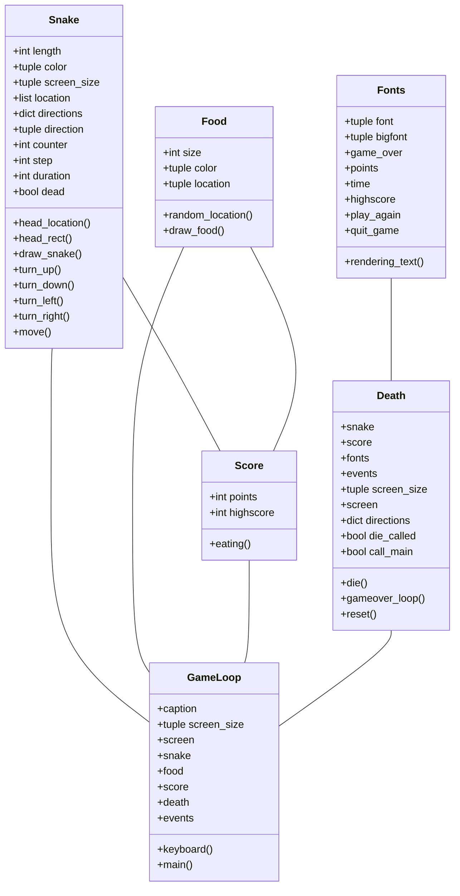

# Arkkitehtuuri
## Ohjelman rakenne
Ohjelmassa on 6 eri luokkaa: Snake, Food, Score, Death, Fonts ja GameLoop.
### Luokkakaavio



## Toiminnallisuus
Kuvataan ohjelman toiminnallisuutta sekvenssikaavioilla.
### Keyboard ja turn funktioiden toiminta:

```mermaid
sequenceDiagram
    actor Player
    participant GameLoop().keyboard()
    participant Snake().turn_up()
    participant Snake().__init__()
    Player ->> GameLoop().keyboard(): press "up" on keyboard
    GameLoop().keyboard() ->> Snake().turn_up(): turn_up()
    Snake().turn_up() ->> Snake().__init__(): direction = up
```

### Funktion move toiminta:

```mermaid
sequenceDiagram
    participant GameLoop().main()
    participant Snake().move()
    participant Snake().__init__()
    GameLoop().main() ->> Snake().move(): move()
    Snake().move() ->> Snake().__init__(): location = new
```

## Ohjelman rakenteen puutteita
Attribuuttien määrä on liian suuri luokassa Snake. Muutama attribuutti on määritelty konstruktorin ulkopuolella, mutta ne ovat attribuutteja, joita käytetään vain omissa funktioissaan.
