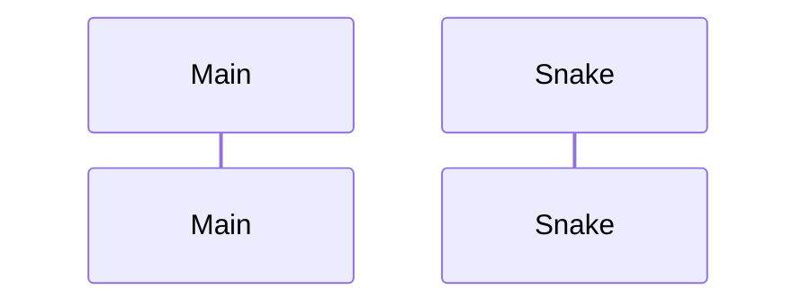

# Arkkitehtuuri
## Ohjelma
Ohjelmassa on 3 eri luokkaa: Snake, Food ja GameLoop.
## Luokkakaavio


## Toiminnallisuus
Kuvataan ohjelman toiminnallisuutta sekvenssikaaviolla
### Keyboard ja turn funktioiden toiminta:

```mermaid
sequenceDiagram
    actor Player
    participant Snake().keyboard()
    participant Snake().turn_up()
    participant Snake().__init__()
    Player ->> Snake().keyboard(): press up on keyboard
    Snake().keyboard() ->> Snake().turn_up(): self.turn_up()
    Snake().turn_up() ->> Snake().__init__(): direction = up
```

### Funktion move toiminta:


