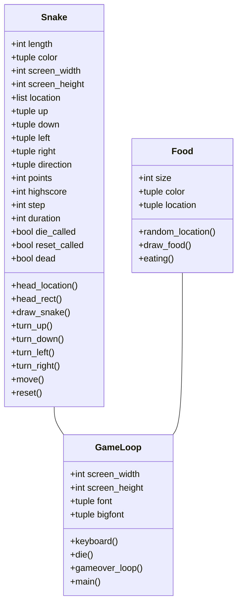

# Arkkitehtuuri
## Ohjelma
Ohjelmassa on 3 eri luokkaa: Snake, Food ja GameLoop.
## Luokkakaavio



## Toiminnallisuus
Kuvataan ohjelman toiminnallisuutta sekvenssikaavioilla
### Keyboard ja turn funktioiden toiminta:

```mermaid
sequenceDiagram
    actor Player
    participant Snake().keyboard()
    participant Snake().turn_up()
    participant Snake().__init__()
    Player ->> Snake().keyboard(): press "up" on keyboard
    Snake().keyboard() ->> Snake().turn_up(): turn_up()
    Snake().turn_up() ->> Snake().__init__(): direction = up
```

### Funktion move toiminta:

```mermaid
sequenceDiagram
    participant GameLoop().main()
    participant Snake().move()
    participant Snake().__init__()
    GameLoop().main() ->> Snake().move(): move()
    Snake().move() ->> Snake().__init__(): location = new
```
